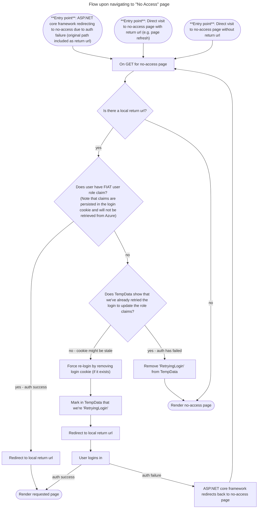

# 20. Handle users authorisation state with roles

**Date**: 2024-10-28

## Status

Accepted

## Context

Currently, when a new user tries to access FIAT without having been added to the correct Azure AD group, they encounter a daunting default error page from Mucrosoft which tells them to contact their "admin".

We want to create a better user experience for people trying to get access to FIAT by redirecting unauthorised users to a page with helpful information.

We were entirely delegating both the **authorisation** and **authentication** to the Microsoft Azure Enterprise application which meant that we were unable to redirect on login failure. Some other applications in the program have enabled a no access page redirect by assigning Roles to user groups in the Microsoft Azure Enterprise application and then moving **authorisation** into the actual web application's codebase.

## Decision

We want to keep consistency with other products in RSD and we also couldn't see another way to enable a redirect to one of our own pages so we decided to adopt the same approach.

- Users permitted to use FIAT will still be onboarded in the same way by being added to the correct Microsoft Entra group.
- **Authentication** is still managed by `Microsoft.Identity.Web` and Microsoft Entra.
- **Authorisation** will be managed by role claims configured in the Microsoft Azure Enterprise application and then evaluated by the FIAT application.

This requires some changes to the authorisation process in FIAT and has implications for security.

- By default every page and route in FIAT will be secured and require the correct user role claim to access.
- The no-access, accessibility, cookies and privacy pages will be specifically opened to unauthorised users.
- The cookies banner should still function for unauthorised users.
- The header and footer will not render components which link to protected areas of the site (such as the Home breadcrumb or header trust search box) for unauthorised users.

## Consequences

There is a disconnect between how we persist login information (in a cookie) and what a user's most up to date role information may be.

When we release the role based authorisation some current users of the may have outdated role claims in their login cookie - we don't want these existing users to face any change or interruption to their use of the application so we mapped out the different states a user can be in at the point they try to access a page on FIAT and whether or not they should be able to access secured pages.

| Example user                                                                                                                                              | Has login cookie   | Has FIAT user role claim in login cookie | Has FIAT user role in azure | Should have access to secured FIAT pages?         |
| --------------------------------------------------------------------------------------------------------------------------------------------------------- | ------------------ | ---------------------------------------- | --------------------------- | ------------------------------------------------- |
| A long-term FIAT user                                                                                                                                     | :heavy_check_mark: | :heavy_check_mark:                       | :heavy_check_mark:          | :muscle: has access                               |
| FIAT User that has just had permissions revoked                                                                                                           | :heavy_check_mark: | :heavy_check_mark:                       | :x:                         | :warning: has access until end of browser session |
| User that followed the get access link on the no access page and has just had access granted (also existing users at the time of release of this feature) | :heavy_check_mark: | :x:                                      | :heavy_check_mark:          | :muscle: has access                               |
| User that has not been setup to use FIAT but has tried to access FIAT before                                                                              | :heavy_check_mark: | :x:                                      | :x:                         | :no_entry: no access                              |
| Invalid state - a cookie can't contain a role if the cookie does not exist                                                                                | ~~:x:~~            | ~~:heavy_check_mark:~~                   | ~~:heavy_check_mark:~~      | n/a                                               |
| Invalid state - a cookie can't contain a role if the cookie does not exist                                                                                | ~~:x:~~            | ~~:heavy_check_mark:~~                   | ~~:x:~~                     | n/a                                               |
| Brand new User that has just been told they have access                                                                                                   | :x:                | :x:                                      | :heavy_check_mark:          | :muscle: has access                               |
| Brand new User that has not been setup to use FIAT                                                                                                        | :x:                | :x:                                      | :x:                         | :no_entry: no access                              |

This exercise allows us to ensure that we cover all permutations of user state to ensure that the user journey for each user is as simple and intuitive as possible for both new and existing users.

We also found that there were several different types of journey that an authorised or unauthorised user might want to make and we needed to behave differently for each

| Request                                                         | Authorised FIAT user outcome | Unauthorised user outcome                                                            |
| --------------------------------------------------------------- | ---------------------------- | ------------------------------------------------------------------------------------ |
| Is navigating to a standard fiat page (like home or a trust)    | Should go to intended page   | Should be redirected to no-access with return url of page they were trying to access |
| Is navigating to an always accessible fiat page (like cookies)  | Should go to intended page   | Should go to intended page                                                           |
| Is navigating to no-access with return url                      | Should go to return url      | Should go to no-access page with return url                                          |
| Is navigating to no-access on purpose (i.e. without return url) | Should go to no-access page  | Should go to no-access page                                                          |

## Implementation

We created a new flow triggered upon navigation to the "No Access" page to ensure that a user's role is up to date and we're not relying on stale claims in a cookie:

Triggering this flow on the `OnGet` of the no access page (rather than by using an authentication handler or cookie authentication events) ensures that we're only doing this extra work in the exceptional circumstance of a user auth failure and gives us easy access to the intended route and the Tempdata. It also allows us to handle cases such as when auth succeeds for a new user but they're just refreshing an old browser tab which had previously redirected to the no-access page.
