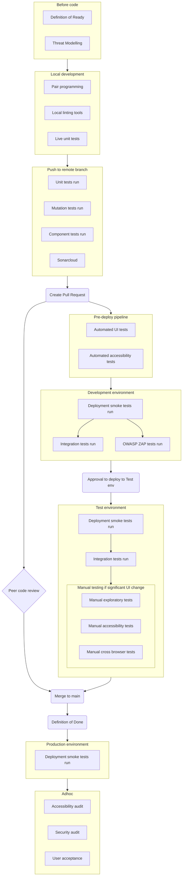

# Test Approach

## Quality Gates diagram

These are the quality assurance steps that code changes go through to ensure that they are correct.

## Details

### Accessibility testing

**Automated** - create/modify a Playwright-axe accessibilty test. Axe will only test the current state of the elements on the screen so make sure different visual states (e.g. expanded/collapsed, hover) are explicitly set and tested.

**Manual** - use the [Accessibility Insights for Web Chrome extension](https://accessibilityinsights.io/docs/web/overview/) and follow the [assessment guide](https://accessibilityinsights.io/docs/web/getstarted/assessment/).

### Cross browser testing

Our application is designed to support Microsoft Edge and Google Chrome laptop/PC users.

**Automated** - by default all Playwright tests are run across multiple browsers. Note that automated tests can only check the functionality of a page and will not spot visual differences between browsers.

**Manual** - exploratory testing on Google Chrome and Microsoft Edge to ensure there are no visual differences between browsers.

### Exploratory testing

This testing is performed as required after a significant UI change. Results are recorded against the relevant "exploratory test" task in DevOps.

### Functional testing

#### Unit

All .NET and TS code is unit tested where possible. Where it is deemed not possible to unit test, code should be marked as excluded from code coverage.
.NET unit test quality is measured by mutation testing tool [Stryker.NET](https://stryker-mutator.io/docs/stryker-net/introduction/) - a mutation score of at least 80% is required before merging to main.

#### Component

Component tests ensure that the units within the application work together as expected. These tests are run in the pipeline before deployment to any environment.

#### UI

UI tests verify that the UI behaves as it should under both happy and unhappy path conditions. These tests are are run before deployment to any environment and have external dependencies (such as APIs) mocked.

#### Integration

Integration tests ensure that the application integrates with other services such as APIs and databases correctly. They are run against Dev and Test environments.

#### Deployment

Deployment smoke tests ensure that all parts of a system have been deployed and are speaking to each other. They are non-invasive and should never change the state of persisted data. They should be quick to run and safe to run against a live environment.
