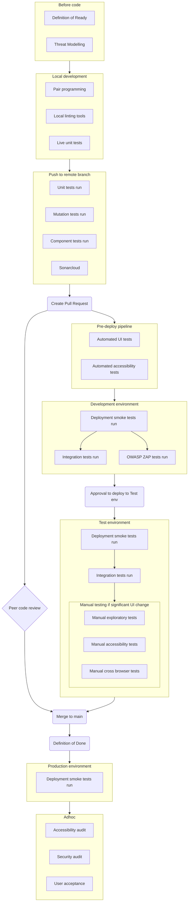

# Test Approach

## Quality Gates diagram

These are the quality assurance steps that code changes go through to ensure that they are correct.

```mermaid
flowchart TB

  subgraph before[Before code]
    before1[Definition of Ready]
    before2[Threat Modelling]
  end

  before-->local

  subgraph local[Local development]
    local1[Pair programming]
    local2[Local linting tools]
    local3[Live unit tests]
  end

  local-->remote

  subgraph remote[Push to remote branch]
    remote1[Unit tests run]
    remote2[Mutation tests run]
    remote3[Component tests run]
    remote4[Sonarcloud]
  end

  remote-->pr

  pr(Create Pull Request)

  pr-->predeploy
  pr-->review

  review{Peer code review}
  
  subgraph predeploy[Pre-deploy pipeline]
    predeploy1[Automated UI tests]
    predeploy2[Automated accessibility tests]
  end

  predeploy-->dev

  subgraph dev[Development environment]
    direction TB
    dev1[Deployment smoke tests run]
    dev1-->dev2
    dev1-->dev3
    dev2[Integration tests run]
    dev3[OWASP ZAP tests run]
  end

  dev-->testenvapproval

  testenvapproval(Approval to deploy to Test env)

  testenvapproval-->test

  subgraph test[Test environment]
    direction TB
    test1[Deployment smoke tests run]
    test1-->test2
    test2[Integration tests run]
    test2-->manual
    subgraph manual[Manual testing if significant UI change]
      manual1[Manual exploratory tests]
      manual2[Manual accessibility tests]
      manual3[Manual cross browser tests]
    end
  end

  test-->merge
  review-->merge

  merge(Merge to main)

  merge-->dod

  dod(Definition of Done)

  dod-->prod

  subgraph prod[Production environment]
    prod1[Deployment smoke tests run]
  end

  prod-->adhoc

  subgraph adhoc[Adhoc]
    adhoc1[Accessibility audit]
    adhoc2[Security audit]
    adhoc3[User acceptance]
  end

```

## Details
