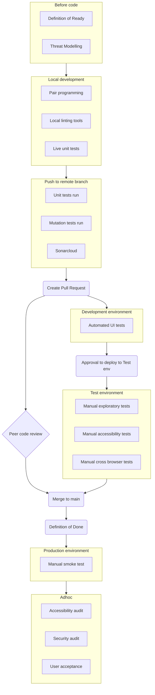

# Test Approach

## Quality Gates diagram

These are the quality assurance steps that code changes go through to ensure that they are correct.

## Details

### Accessibility testing

**Automated** - create/modify a Cypress-axe accessibilty test. Axe will only test the current state of the elements on the screen so make sure different visual states (e.g. expanded/collapsed, hover) are explicitly set and tested.

**Manual** - use the [Accessibility Insights for Web Chrome extension](https://accessibilityinsights.io/docs/web/overview/) and follow the [assessment guide](https://accessibilityinsights.io/docs/web/getstarted/assessment/).

### Cross browser testing

Our application is designed to support Microsoft Edge and Google Chrome laptop/PC users.

**Automated** - there are no automated cross browser tests.

**Manual** - exploratory testing on Google Chrome and Microsoft Edge to ensure there are no visual differences between browsers.

### Exploratory testing

This testing is performed as required after a significant UI change. Results are recorded against the relevant "exploratory test" task in DevOps.

Exploratory testing should use the testers experience with the product to direct their testing of the syste]m/s.

A test charter should be used to bring structure to this testing including an entry and exit criteria, areas under test, bug recording and relevant test date.

### Functional testing

#### Unit

All .NET code is unit tested where possible. Where it is deemed not possible to unit test, code should be marked as excluded from code coverage.
.NET unit test quality is measured by mutation testing tool [Stryker.NET](https://stryker-mutator.io/docs/stryker-net/introduction/) - a mutation score of at least 80% is required before merging to main.

#### UI

UI tests verify that the UI behaves as it should under both happy and unhappy path conditions.

### Security testing

#### Audit

As required, specialist security audits will be carried out against the service.
